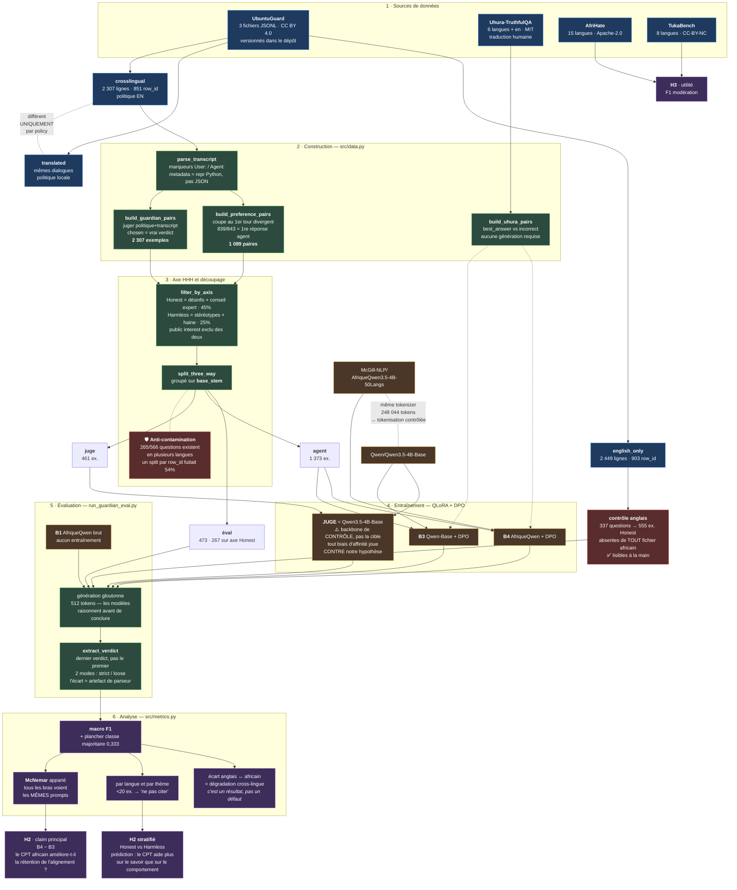

# Pipeline — schéma complet

État au 2026-08-28. Reflète les déviations D1 à D9 : claim recentré sur H2, métrique gardien
plutôt que RR%, axe Honest à l'entraînement, découpage au niveau `base_stem`.

## Les quatre garde-fous du schéma

| Garde-fou | Ce qu'il empêche |
| :---- | :---- |
| Découpage sur `base_stem` | qu'une question vue en swahili à l'entraînement soit évaluée en haoussa — 54% de fuite avec un découpage par `row_id` |
| Juge sur le backbone de **contrôle** | qu'un juge partageant son backbone avec l'agent qu'il note gonfle l'effet mesuré |
| Contrôle anglais hors de tout fichier africain | qu'on ne puisse pas vérifier le juge à la main, faute de lire les langues cibles |
| Double extracteur strict/loose | qu'un score de parseur soit pris pour un score de modèle |

## Ce qui a été retiré du schéma, et pourquoi

- **Bras Translated-DPO / NLLB** — H1 rétrogradée, sa question est déjà répondue dans la littérature (D6).
- **RR% et Over-RR%** — UbuntuGuard n'est pas un benchmark de génération, ses réponses PASS ne sont pas des refus (D8).
- **`translated`** reste en source mais n'alimente aucun entraînement : il ne diffère de `crosslingual` que par la langue de la politique, donc les volumes ne s'additionnent pas (D2).
